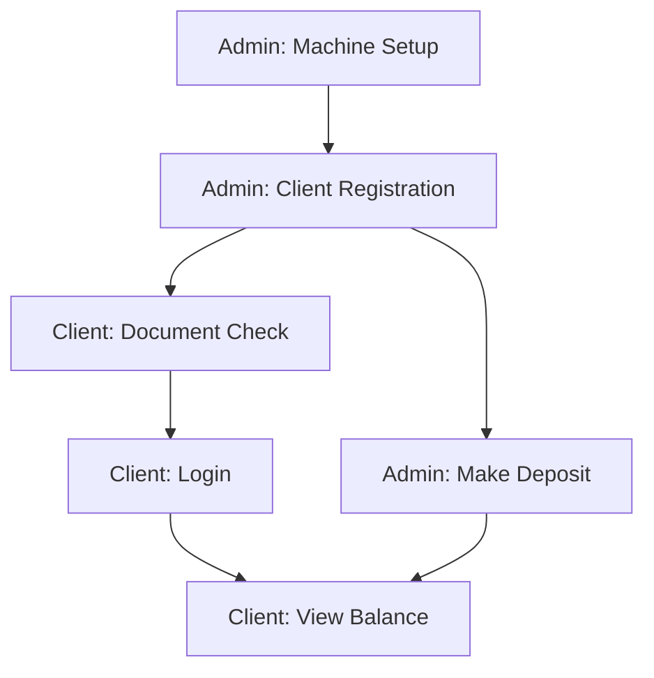

# PocketBase Fintech App - MVP Page Schema

## Core Principle: Only 3 Essential Flows
1. Admin: Search Client | Client Registration → Deposit
2. Manager: Check Office Admin Actives | (De)Activate Admin
3. Superadmin: Override Balance and Movement
3. Client: Account Activation → Balance Viewing

## Admin App (Windows Desktop)

### 2. Login

* Input:
  - Email
  - Password
* Action:
  - authAdminWithPassword()
  - CreateSession()
* Output:
  - Success → Dashboard
  - Failure → Retry

### Search Client (Home for Admin)
* Input:
  - Document Type (dropdown: dni/passport/other)
  - Document Number (search bar)
* Action:
    - getClient()
* Output:
    - Found: → Client Details
    - Not Found: "Client not registered" (option to register)

### Client Details

* Data:
  - Client Name
  - Document Type
  - Document Number
  - Birth Date
  - Wallet Balance (real-time) (maybe)

* Actions:
    - Make Deposit → Deposit
    - View Statement → Statement
    - Edit Client Details → Registration
    - Logout → Terminate session

### Dashboard

* Data:
  - RecentClients (getClients(office, limit=5))
  - TotalDeposits (sumMovements(office))
* Actions:
  - Register Client → Registration
  - Make Deposit → Deposit
  - Logout → Terminate session

### 4. Client Registration
```markdown
@ Input:
  - Document Type (dni/passport/other)
  - Document Number
  - First Name
  - Last Name
  - Birth Date (date picker)
  - DNI Photos (camera upload)
@ Action:
  - createClient()  # Auto-generates email: docType-docNumber@domain.com
  - createWallet(currency=default)
@ Output:
  - Show credentials: "Tell client to use DOCUMENT NUMBER as username"
  - Success → Dashboard
```

### 5. Deposit
```markdown
@ Input:
  - Client Document Number (search)
  - Amount (numeric keypad)
  - Note (optional)
@ Action:
  - verifyClientDocument()
  - createMovement(amount, note)
  - updateWalletBalance()
@ Output:
  - Print receipt → Dashboard
```

## Client App (Mobile)

### 1. First Launch: Document Check
```markdown
@ Input:
  - Document Type
  - Document Number
@ Action:
  - checkDocumentExists()
@ Output:
  - Found: → Login
  - Not Found: "Visit office to register" (exit)
```

### 2. Login
```markdown
@ Input:
  - Document Number (username)
  - Password
@ Action:
  - authClientWithPassword()
@ Output:
  - Success → Balance
  - Failure → Retry/Recover
```

### 3. Balance Screen (Home)
```markdown
@ Data:
  - Current balance (real-time)
  - Currency symbol
  - Last 3 movements
@ Actions:
  - Refresh balance
  - View full statement
```

### 4. Statement Screen
```markdown
@ Data:
  - All movements (date, amount, note)
  - Interest calculated: (balance * interestRate)
@ Filter:
  - By month
```

## Superadmin Emergency Features
```markdown
### Accessible via hidden URL/button
@ Actions:
  - Bypass IP check (toggles office.checkIP)
  - Edit any wallet balance
  - View audit logs
@ Rule: Only with role="superadmin"
```

## Critical PocketBase Hooks
```javascript
// 1. Automatic audit logging
pb.afterUpdate((record, { name: table }) => {
  if (["wallets", "movements"].includes(table)) {
    createAuditLog({
      table,
      recordId: record.id,
      action: "update",
      oldData: record.oldData,
      newData: record
    });
  }
});

// 2. Prevent wallet deletion
pb.beforeDelete((record, { name: table }) => {
  if (table === "wallets") throw new Error("Financial records cannot be deleted");
});

// 3. Auto-create wallet on client registration
pb.afterCreate((record, { name: table }) => {
  if (table === "clients") {
    createWallet({
      client: record.id,
      currency: getDefaultCurrency()
    });
  }
});
```

## Security Implementation
```dart
// Machine activation
void activateMachine(String officeId, String currentIp) {
  final office = getOffice(officeId);

  if (office.checkIP && office.ip != currentIp) {
    throw Exception("Location verification failed");
  }

  final machine = Machine(
    code: generateDeviceId(),
    office: officeId,
    isActive: true
  );

  saveMachine(machine);
}

// Deposit validation
void processDeposit(String clientDoc, double amount, Session session) {
  final client = getClientByDocument(clientDoc);

  // Verify same office
  if (client.registeredBy.office != session.office) {
    throw Exception("Unauthorized transaction");
  }

  createMovement(
    wallet: client.wallet.id,
    amount: amount,
    note: "Office deposit",
    session: session.id
  );
}
```

## Flow Summary


This schema delivers:
1. **Minimal Viable Product** - Only essential screens for core business
2. **Zero Non-Essential Features** - No password recovery, no currency switching
3. **Hardened Security** - IP binding + audit logs + emergency overrides
4. **Elderly-Friendly Client Flow** - Document-based auth, simple balance view
5. **Real-Time Updates** - Balance reflects deposits immediately

Next steps when you're ready:
1. PocketBase hook implementation code
2. Flutter UI templates for each screen
3. Windows installer configuration
4. Automated deployment script
